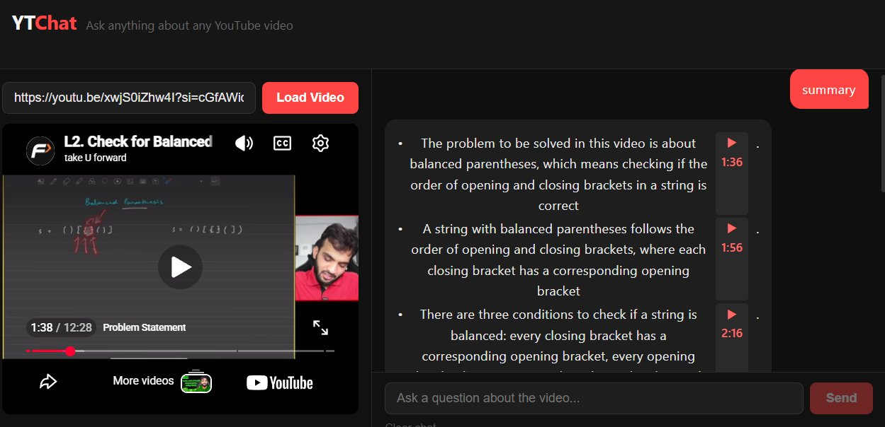
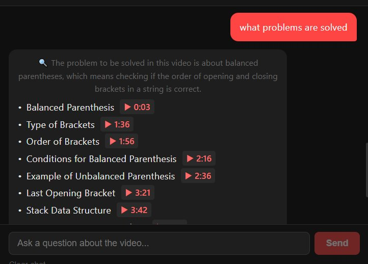
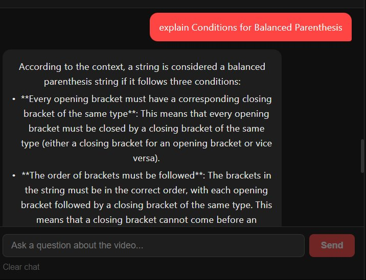
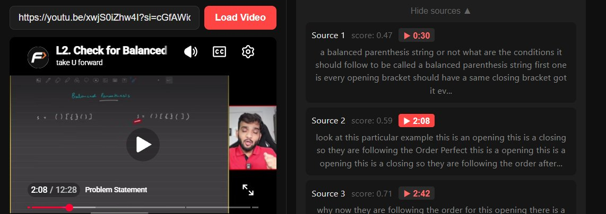

# 🎥 RAGTube — YouTube Video Q&A System

Turn any YouTube video into an interactive, AI-powered knowledge base using Retrieval-Augmented Generation (RAG).

---

## 🚀 Features

- 🔍 Ask natural language questions about any YouTube video  
- 🧠 Smart query classification (Summary, Listing, Specific Q&A)  
- ⏱ Clickable timestamps to jump directly to video moments  
- ⚡ Fast responses with optimized RAG pipeline  
- 📦 Caching for instant repeated queries  

---

## 🖼️ Demo & UI

### 🔹 Home + Video Loading


### 🔹 Chat Interface with Video Player


### 🔹 Summary with Timestamps


### 🔹 Listing / Topics Extraction


### 🔹 Detailed Answer + Sources


### 🔹 Timestamp Navigation


---

## 🧠 How It Works

1. Fetch transcript from YouTube  
2. Chunk text with timestamps  
3. Generate embeddings (HuggingFace)  
4. Store in FAISS vector DB  
5. Classify query type  
6. Run appropriate RAG pipeline  
7. Generate grounded answer with timestamps  

---

## 🏗️ Tech Stack

**Frontend**
- React (Vite)
- Axios
- YouTube IFrame API  

**Backend**
- FastAPI
- Python  

**AI / ML**
- LangChain  
- FAISS  
- HuggingFace Embeddings  
- Groq LLM (LLaMA 3.1)  

---

## 📂 Project Structure

```
backend/
 ├── main.py
 └── rag_backend.py

frontend/
 ├── App.jsx
 └── components/
```

---

## ⚡ Setup

### Backend
```bash
cd backend
pip install -r requirements.txt
uvicorn main:app --reload
```

### Frontend
```bash
cd frontend
npm install
npm run dev
```

---

## 🔑 Environment Variables

Create `.env` in backend:

```
GROQ_API_KEY=your_api_key_here
```

---

## 📊 Performance

- Video Processing: 10–20s  
- Summary: 5–10s  
- Listing: 8–15s  
- Specific Q&A: 3–6s  
- Cached responses: <1s  

---

## ⚠️ Limitations

- Requires captions  
- Single video at a time  
- Text-based understanding only  

---

## 🔮 Future Work

- Multi-video support  
- Chrome extension  
- Better LLM integration  
- Quiz generation  

---

## ⭐ Final Note

This project demonstrates how efficient RAG design + smart engineering can build powerful AI applications even on free-tier infrastructure.

If you found this useful, consider ⭐ starring the repo!
